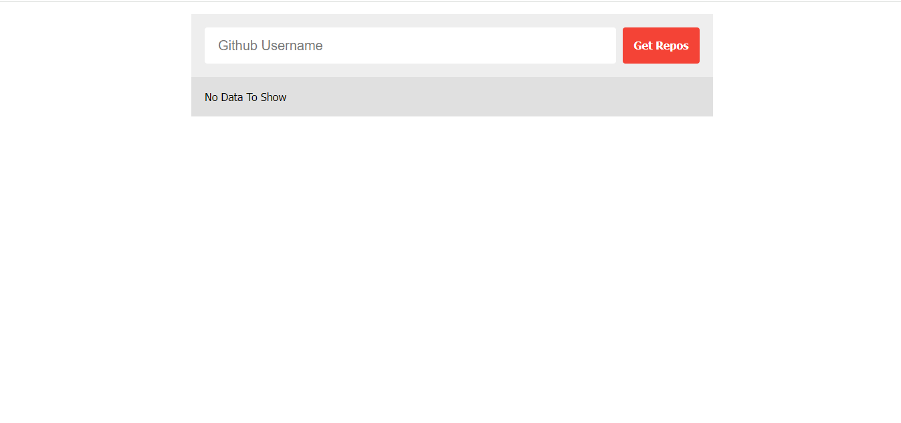

# Fetch_Github_Repositories
A simple web application to fetch and display GitHub repositories for a given username. Built with HTML, CSS, and JavaScript.

## Table of contents

- [Overview](#overview)
  - [Usage](#Usage)
  - [Links](#links)
  - [Screenshot](#Screenshot)
- [My process](#my-process)
  - [Features](#Features)
  - [What I learned](#what-i-learned)
  - [Continued development](#continued-development)
- [Author](#author)
- [Acknowledgments](#Acknowledgments)

## overview
This project allows users to enter a GitHub username and fetch the repositories associated with that username. The application displays the repository names, visit links, and star counts. It includes a loading indicator and handles errors gracefully, providing a user-friendly experience.

## Usage
1. Open `index.html` in your web browser.
2. Enter a GitHub username in the input field.
3. Click the "Get Repos" button to fetch and display the repositories.

### Links

If you want to open the link in a new tab, you can:

- Press **Ctrl** (or **Cmd** on Mac) while clicking the link.
- Right-click the link and select **Open link in new tab**.

Otherwise, all links will open in the same tab.

- Solution URL: [here](https://github.com/olahasan/Fetch_Github_Repositories)

- Live Site URL: [here](https://olahasan.github.io/Fetch_Github_Repositories/)

 ## Screenshot
 

## my-process

## Features
- Fetch GitHub repositories by username
- Display repository names, visit links, and star counts
- Responsive design
- Loading indicator and error handling

## what-i-learned
- How to use the GitHub API to fetch data.
- Handling asynchronous operations using `fetch` and promises.
- Implementing error handling for network requests.
- Enhancing user experience with loading indicators and responsive design.

## Continued Development
- Improve error messages to provide more specific feedback.
- Optimize the code for better performance and readability.
- Add more features, such as filtering repositories by language or stars.
- Implement additional styling and animations to enhance the user interface.

### Author

GitHub - @olahasan

### Acknowledgments

I would like to thank the **[Elzero Web School](https://elzero.org/)** for providing this challenge and to the community for their support.

